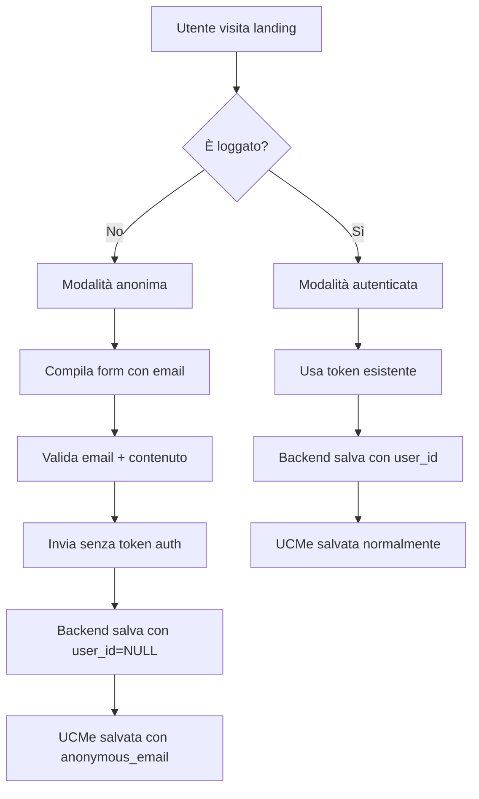

# Implementazione UCMe Anonime - Mental Commons

## 📋 Panoramica

È stato implementato il supporto completo per l'invio di UCMe senza necessità di registrazione o login. Gli utenti possono ora inviare i loro pensieri direttamente dalla landing page fornendo solo la propria email per ricevere la risposta.

## 🚀 Modifiche Implementate

### 1. Backend API (`api/ucme.js`)

**Versione aggiornata: 2.3.0**

- ✅ **Autenticazione opzionale**: L'API ora accetta richieste sia con che senza token di autenticazione
- ✅ **Validazione email**: Per UCMe anonime è richiesta e validata l'email nel body della richiesta
- ✅ **Modalità mista**: Supporta sia UCMe autenticate (con user_id) che anonime (con anonymous_email)
- ✅ **Fallback migliorato**: Anche la modalità fallback supporta UCMe anonime

**Modifiche principali:**
```javascript
// Autenticazione opzionale
const authHeader = req.headers.authorization;
let decoded = null;
let isAnonymous = false;

if (authHeader && authHeader.startsWith('Bearer ')) {
  // Verifica token se presente
} else {
  // Modalità anonima
  isAnonymous = true;
}
```

### 2. Database Schema (`docs/legacy-sql/add-anonymous-ucme-support.sql`)

**Nuove colonne aggiunte alla tabella `ucmes`:**
- `is_anonymous` (boolean): Indica se la UCMe è anonima
- `anonymous_email` (text): Email fornita per UCMe anonime

**Constraint di validazione:**
- UCMe anonime devono avere `user_id = NULL` e `anonymous_email != NULL`
- UCMe autenticate devono avere `user_id != NULL` e `is_anonymous = false`

**RLS Policies aggiornate:**
- Permettono inserimento di UCMe anonime
- Garantiscono che solo i Portatori assegnati possano leggere UCMe anonime

### 3. Modulo Supabase (`api/supabase.js`)

**Nuova funzione aggiunta:**
```javascript
async function saveAnonymousUCMe(email, content, title = null) {
  // Salva UCMe con user_id=NULL e anonymous_email
}
```

**Esportazione aggiornata:**
```javascript
module.exports = {
  // ... altre funzioni
  saveUCMe,
  saveAnonymousUCMe,  // ← Nuova funzione
  // ... altre funzioni
};
```

### 4. Frontend JavaScript (`script.js`)

**Nuova funzione per UCMe anonime:**
```javascript
async function submitAnonymousUCMe(formData) {
  // Invio senza token di autenticazione
  // Validazione email obbligatoria
  // Headers senza Authorization
}
```

**Logica automatica di selezione modalità:**
```javascript
// In handleFormSubmission()
if (currentUser && currentUser.email) {
  result = await submitUCMeToVercel(formData);  // Autenticata
} else {
  result = await submitAnonymousUCMe(formData); // Anonima
}
```

## 🔧 Istruzioni di Deployment

### 1. Aggiornamento Database
Eseguire lo script SQL nel database Supabase:
```bash
# Eseguire nel SQL Editor di Supabase:
docs/legacy-sql/add-anonymous-ucme-support.sql
```

### 2. Deploy Codice
Le modifiche al codice sono già pronte e compatibili con il deployment esistente.

### 3. Test
- ✅ **Test UCMe autenticate**: Funzionano come prima
- ✅ **Test UCMe anonime**: Nuovo flusso con email obbligatoria
- ✅ **Test fallback**: Modalità di emergenza supporta entrambe

## 📊 Flusso UCMe Anonime



## 🔒 Sicurezza e Privacy

### UCMe Anonime
- **Email**: Richiesta solo per invio risposta, non per identificazione
- **Dati**: Nessun dato personale memorizzato oltre email e contenuto
- **Accesso**: Solo Portatori assegnati possono leggere UCMe anonime
- **Tracking**: Nessun collegamento con account utente

### UCMe Autenticate
- **Funzionalità**: Rimangono invariate
- **Privacy**: Stesse politiche esistenti
- **Dashboard**: Disponibile solo per utenti registrati

## 🎯 Benefici dell'Implementazione

1. **Accessibilità**: Riduce la barriera d'ingresso per nuovi utenti
2. **Privacy**: Permette condivisione completamente anonima
3. **Gradualità**: Gli utenti possono provare il servizio prima di registrarsi
4. **Compatibilità**: Mantiene piena compatibilità con il sistema esistente
5. **Scalabilità**: Backend pronto per gestire entrambe le modalità

## 🚨 Note Importanti

⚠️ **Database Update Required**: Lo script SQL deve essere eseguito prima del deployment

⚠️ **Testing**: Testare entrambe le modalità (autenticata e anonima) prima della produzione

⚠️ **Monitoring**: Monitorare l'uso delle UCMe anonime per analizzare l'impatto

## 📈 Metriche da Monitorare

- Numero di UCMe anonime vs autenticate
- Tasso di conversione da anonimo a registrato
- Tempo di risposta per UCMe anonime
- Errori specifici per modalità anonima

---

**Implementazione completata il**: 2025-01-21  
**Versione API**: 2.3.0  
**Compatibilità**: Retrocompatibile al 100% 